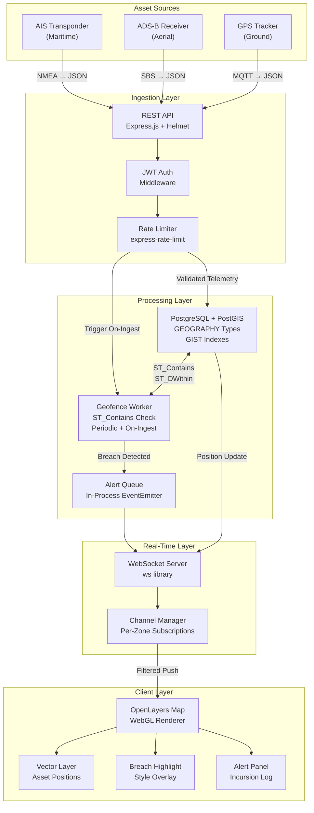
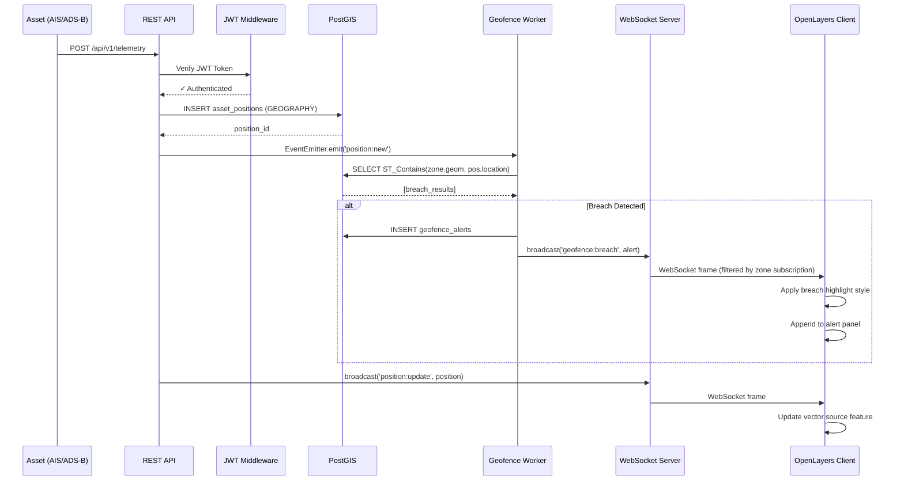
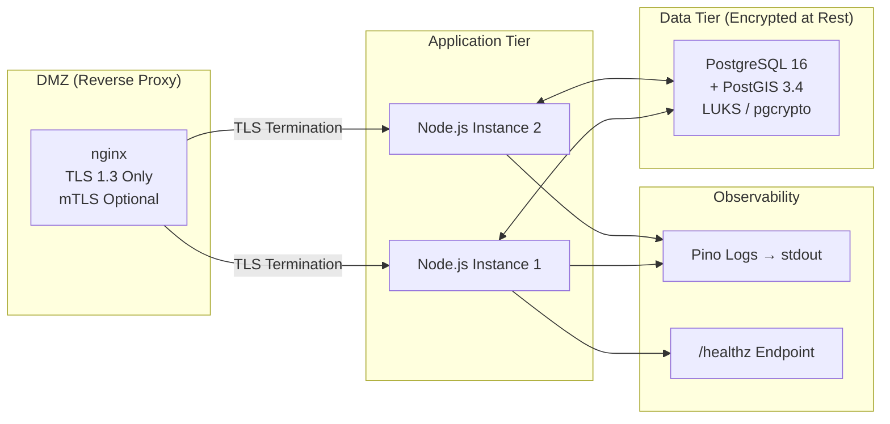

# Secure GEOINT Dashboard — System Architecture

## Classification: UNCLASSIFIED

---

## 1. High-Level Data Flow

## 2. Component Interaction Sequence

## 3. Deployment Topology (Protected B)

## 4. Security Architecture

| Layer          | Control                                   | Implementation                                   |
| -------------- | ----------------------------------------- | ------------------------------------------------ |
| Transport      | TLS 1.3                                   | nginx reverse proxy, `Strict-Transport-Security` |
| Authentication | JWT (HS256→RS256 in prod)                 | `jsonwebtoken`, 8h expiry, refresh rotation      |
| Authorization  | Role-based (OPERATOR / ANALYST / ADMIN)   | Middleware checks `req.user.role`                |
| API Security   | Rate limiting, CORS, Helmet               | `express-rate-limit`, `helmet()`, strict CORS    |
| WebSocket Auth | JWT verified on `upgrade`                 | Token in first message or query param            |
| Database       | Connection pooling, parameterized queries | `pg` pool, `$1` placeholders (no string concat)  |
| Data at Rest   | Encrypted volumes                         | LUKS (Linux), pgcrypto for PII columns           |
| Logging        | Structured, no PII in logs                | Pino with redaction paths                        |

## 5. Data Residency & Sovereignty

For DND Protected B classification:

- All data must reside within Canadian sovereign infrastructure
- PostgreSQL instances must run on CSE-approved cloud regions (e.g., Canada Central)
- No telemetry data leaves the national boundary
- Backup encryption keys managed via HSM or KMS within Canadian jurisdiction
